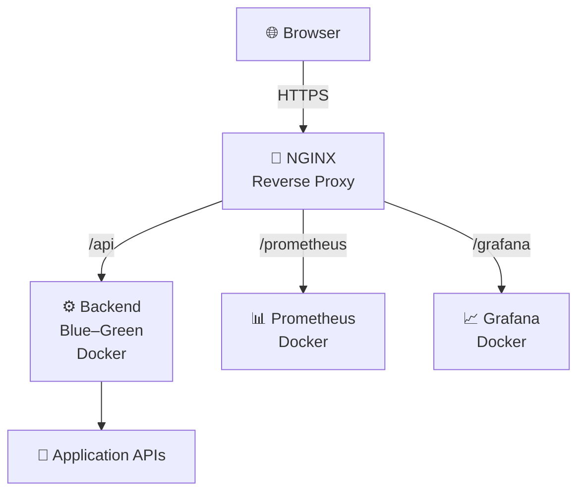

# 🏥 DoctorX24 – Infrastructure & DevOps Setup

Production-ready **DevOps & monitoring architecture** for the DoctorX24 backend, built with **Docker, Nginx, Prometheus, Grafana, and Alertmanager**, supporting **Blue-Green deployments**, **zero downtime**, and **automatic recovery**.

---

## ✨ Key Features

- 🔵🟢 **Blue-Green backend deployments**
- 🔐 **HTTPS with Let’s Encrypt (Certbot)**
- 🔁 **Zero-downtime Nginx switching**
- 📊 **Monitoring with Prometheus**
- 📈 **Dashboards using Grafana**
- 🚨 **Email alerts via Alertmanager**
- ♻️ **Docker healthchecks & auto-restart**
- 🔒 **Basic Auth for Prometheus & Grafana**


---  

## 🏗️ Architecture Diagram  



## 🧰 Tech Stack

| Layer | Technology |
|-----|-----------|
| Containerization | Docker |
| Orchestration | Docker Compose |
| Reverse Proxy | Nginx |
| SSL | Let’s Encrypt |
| Monitoring | Prometheus |
| Visualization | Grafana |
| Alerting | Alertmanager |
| CI/CD | GitHub Actions |

---

## 🚀 Deployment Strategy (Blue-Green)

- Two backend environments:
  - **backend-blue**
  - **backend-green**
- Only one is active at a time
- Traffic is switched via **Nginx upstream**
- Rollback is instant by switching back


---

## 📡 Monitoring

### 🔹 Prometheus
- Scrapes:
  - cAdvisor
  - Node Exporter
  - Docker metrics
- Protected using **Basic Authentication**
- Served via subpath

🔗 **URL:**  
`https://api.abhiroom.in/prometheus`

---

### 🔹 Grafana
- Visual dashboards for:
  - CPU & Memory
  - Container health
  - Service uptime
- Protected using **Basic Auth + Grafana login**
- Served via subpath

🔗 **URL:**  
`https://api.abhiroom.in/grafana`

---

## 🚨 Alerts Implemented

| Alert | Description |
|----|-----------|
| BackendHighCPU | CPU usage above threshold |
| ContainerDown | Container stops reporting metrics |

Alerts follow **Pending → Firing** lifecycle to prevent noise.

---

## ♻️ Healthchecks & Auto-Recovery

- All critical containers include:
  - Docker `HEALTHCHECK`
  - `restart: unless-stopped`
- Containers automatically restart on failure

---

## 🔐 Security

- HTTPS enforced (domain only)
- HTTP → HTTPS redirection
- HTTPS IP requests dropped
- Basic Auth for monitoring endpoints
- Strict reverse proxy routing

---

## 🌍 Important URLs

| Service | URL |
|------|----|
| Backend API | https://api.abhiroom.in/api |
| Prometheus | https://api.abhiroom.in/prometheus |
| Grafana | https://api.abhiroom.in/grafana |

---

## 🧪 Useful Commands

### Start services
```bash
docker compose up -d
```
### View running containers
```bash
docker ps
```
### Switch backend (Blue → Green)
```bash
nginx/scripts/switch-backend.conf 
sudo nginx -s reload
```
### Load testing
```bash
ab -n 5000 -c 200 https://api.abhiroom.in/api/health
```
